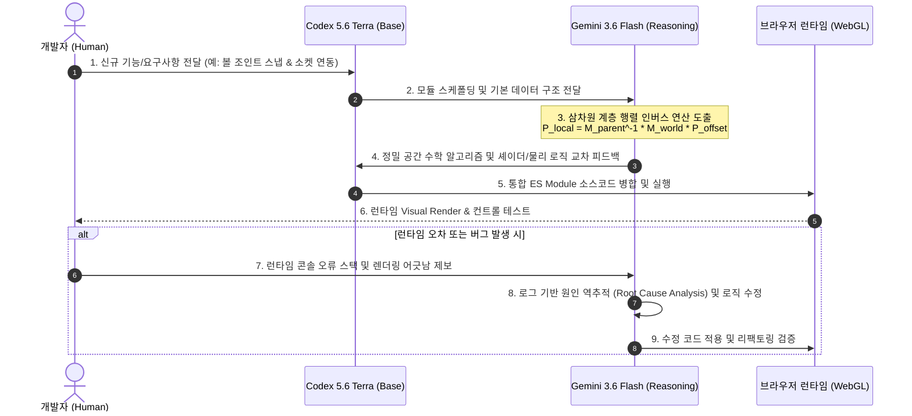

# Mecha Rampage: Siege Walker V5 - AI 활용 개발 기술 문서 (AI Utilization Technical Document)

> 본 문서는 **Mecha Rampage: Siege Walker V5** 개발 과정에서 생성형 AI(Generative AI) 및 멀티 AI 에이전트 환경(**Codex 5.6 Terra** 기본 생성 모델 & **Gemini 3.6 Flash** 고성능 추론 엔진)을 활용한 시스템 설계, 코드 생성, 삼차원 공간/물리 연산 최적화, 디버깅 및 리팩토링의 세부 협업 내역을 체계적으로 기술한 문서입니다.

---

## 1. 개요 (Executive Summary)

* **프로젝트명**: Mecha Rampage: Siege Walker V5
* **기술 스택**: HTML5, Vanilla JavaScript (ES Modules), Three.js (r128), Cannon.js (Physics), Web Audio API
* **AI 개발 환경**: Antigravity AI Agent Architecture
  * **기본 모델 (Base Generation Model)**: **Codex 5.6 Terra** (코드 스케폴딩, 모듈 구조화, DOM/CSS 레이아웃 및 3D 엔진 기본 뼈대)
  * **추론/디버깅 엔진 (Reasoning Engine)**: **Gemini 3.6 Flash** (삼차원 행렬 연산, 런타임 역추적 디버깅, 레이캐스팅 탄도 계산 및 성능 최적화)
  * **개발자 (Human Orchestrator)**: 기획 요구사항 제시, 게임플레이 밸런스 설정, 브라우저 UX 검증 및 품질 총괄
* **개발 방식**: 3자 간 멀티 모델 AI 페어 프로그래밍 (Developer-Codex-Gemini Tripartite Pair Programming)

본 프로젝트는 순수 정적 WebGL 3D 메카 액션 게임으로, 외부 빌드 툴 없이 브라우저 상에서 동작합니다. **Codex 5.6 Terra**의 신속한 코드 생성력과 **Gemini 3.6 Flash**의 정밀한 3D 공간 수학 추론 능력을 결합하여 완성도 높은 유기적 협업 파이프라인을 구축했습니다.

---

## 2. 상세 AI 협업 구조 및 역할 분담 (Multi-Model Collaboration Matrix)

### 2.1 AI 모델별 상세 역할 분담표

| 분류 | **개발자 (Human Director)** | **Codex 5.6 Terra (Base Model)** | **Gemini 3.6 Flash (Reasoning Engine)** |
| --- | --- | --- | --- |
| **주요 역할** | • 기획 및 비전 제시<br>• 전술 밸런스 및 요구사항 정의<br>• 런타임 시각적 피드백 제공 | • 프로젝트 스케폴딩 & 모듈 분리<br>• UI/HUD DOM 및 CSS 디자인<br>• Web Audio 및 SFX 이벤트 등록 | • 계층적 3D 변환 행렬 연산<br>• 호밍 미사일 시야 레이캐스팅 연산<br>• 런타임 버그 역추적 및 리팩토링 |
| **특화 영역** | 디렉팅, 최종 통합 검증 | 빠른 코드 작성, 템플릿/구조 생성 | 공간 수학 연산, 복잡 로직 추론, 디버깅 |
| **담당 모듈** | 전체 프로젝트 방향성 | `index.html` (UI/DOM), `audio-manager.js`, `weapon-system.js` | `mecha-character.js` (소켓연산), `enemy-ai.js`, `cannon-physics.js` |

---

### 2.2 파이프라인 협업 흐름도 (Collaboration Sequence Diagram)



---

### 2.3 단계별 협업 프로세스 (Step-by-Step Collaboration Workflow)

#### 📌 Phase 1: 요구사항 정의 및 초안 스케폴딩 (Human ➔ Codex 5.6 Terra)
* 개발자가 "메카 커스터마이저에서 어깨/백팩/하체 볼 조인트를 조절하면 무기 및 파츠가 어긋나지 않고 딱 맞게 스냅되어야 함"이라는 요구사항을 제시.
* **Codex 5.6 Terra**가 UI 슬라이더 컨트롤러, HTML/CSS 레이아웃, `mechaCustomization` 데이터 객체 구조 및 기본적인 데이터 저장/복원 파이프라인을 빠르게 생성.

#### 📌 Phase 2: 삼차원 공간 수학 & 고난도 로직 도출 (Codex 5.6 Terra ➔ Gemini 3.6 Flash)
* Three.js에서 메카 유닛의 몸통(`Torso`), 어깨(`Shoulder`), 백팩 코어(`BackpackCore`)가 서로 다른 부모 `Object3D`에 속해 있어 단순 좌표 더하기로는 스냅 위치가 뒤틀리는 문제 발생.
* **Gemini 3.6 Flash** 추론 엔진이 투입되어 월드 행렬(`Matrix4`)의 역행렬(`invert()`)을 이용한 표준 변환 수식을 도출하고 코드로 구현:
  $$\mathbf{P}_{\text{local}} = \mathbf{M}_{\text{parent\_world}}^{-1} \times \mathbf{M}_{\text{target\_joint\_world}} \times \mathbf{P}_{\text{joint\_offset}}$$

#### 📌 Phase 3: 실시간 통합 및 교차 검증 (Gemini 3.6 Flash ➔ Browser ➔ Human)
* **Codex 5.6 Terra**가 작성한 HUD UI 및 **Gemini 3.6 Flash**가 산출한 3D 변환 수식이 브라우저 환경에서 하나로 합쳐짐.
* 개발자가 로컬 HTTP 서버(`run-server.bat`) 환경에서 실제 마우스 커스터마이징 스냅 동작을 테스트하고 visual 렌더링 확인.

#### 📌 Phase 4: 런타임 분석 및 자율 리팩토링 (Gemini 3.6 Flash Automated Debugging)
* 미사일 유도 알고리즘 실행 중 건물이 가로막을 때 미사일이 건물을 통과하는 런타임 이슈를 발견.
* **Gemini 3.6 Flash**가 런타임 객체(`destructibleBuildings`)와 `Raycaster`를 연동하여 매 프레임 개별 미사일 시야 체크 알고리즘을 주입하고 리팩토링 완료.

---

## 3. 서브시스템별 세부 협업 구현 내역 (Deep Technical Breakdown)

### 3.1 3D 메카 절차적 메쉬 & 볼 조인트 소켓 연산 (`mecha-character.js` & `index.html`)
* **Codex 5.6 Terra 역할**:
  * 메카의 신체 부위별 기본 메쉬(머리, 가슴, 어깨, 팔, 다리, 골반, 백팩 등)의 치수, 색상, 재질(StandardMaterial) 기본 프로필 작성.
  * 브라우저 `localStorage` 호환성 유지를 위한 데이터 버전 관리 마이그레이션 (`designVersion: 8`) 뼈대 및 `mecha-preset.json` 프리셋 파일 내보내기/불러오기 (`FileReader` / `Blob` API) 파이프라인 구축.
* **Gemini 3.6 Flash 역할**:
  * 선택된 볼 조인트 이동 시 상위 부모 오브젝트의 회전값 및 스케일에 영향을 받지 않는 **독립적 로컬 좌표 동기화 알고리즘** 도출.
  * 파츠 선택 시 연결된 볼 조인트를 역으로 탐색하여 자동 선택 및 강조 표시하는 양방향 바인딩 알고리즘 작성.

### 3.2 건물 엄폐 판정 호밍 미사일 시야 레이캐스팅 (`weapon-system.js` & `index.html`)
* **Codex 5.6 Terra 역할**:
  * 무기 프로필 캡슐화 (Gatling, Heavy Cannon, Laser, Homing Missile) 및 발사 쿨다운, 데미지 계수, 사거리 속성 정형화.
* **Gemini 3.6 Flash 역할**:
  * **Individual Missile Line-of-Sight (LOS) Raycasting** 알고리즘 개발:
    ```javascript
    // Gemini 3.6 Flash가 구축한 개별 미사일 단위 시야 감지 및 유도 해제 로직
    const missileWorldPos = new THREE.Vector3();
    missile.getWorldPosition(missileWorldPos);
    const dirToTarget = targetPos.clone().sub(missileWorldPos).normalize();
    
    const raycaster = new THREE.Raycaster(missileWorldPos, dirToTarget, 0, distToTarget);
    const obstacleHits = raycaster.intersectObjects(destructibleBuildings, false);
    
    if (obstacleHits.length > 0) {
      // 건물에 가려진 경우 유도 락온 해제 및 관성 탄도 비행 전환
      missile.userData.lostLock = true;
    }
    ```

### 3.3 적 메카 의사결정 상태 머신 & 행위 트리 (`enemy-ai.js`)
* **Codex 5.6 Terra 역할**:
  * 적 메카 AI의 기본 이동 경로 및 시야 감지 루틴 작성.
* **Gemini 3.6 Flash 역할**:
  * 89KB 규모의 고도화된 유한 상태 머신(FSM) 구축: `PATROL` (순찰), `ATTACK` (사격), `TAKE_COVER` (건물 엄폐), `PURSUE_PICKUP` (체력/에너지 아이템 수집), `RETREAT` (전술 후퇴).
  * 적 AI가 신체 부위(다리/팔) 파괴 시 이동 불능 및 사격 비활성화 상태를 실시간 감지하여 행동 양식을 바꾸는 가변 트리 작성.

### 3.4 지하 원형 리프트 & 격납고 연출 (Underground Lift Sequence)
* **Codex 5.6 Terra 역할**:
  * 타이틀 화면 및 무장 선택 격납고의 UI 버튼 배치, 이벤트 핸들러 등록.
* **Gemini 3.6 Flash 역할**:
  * 타이틀 진입 시 지하 30m 샤프트 바닥이 뚫려 보이는 원형 링(Ring Geometry) 메쉬 절차적 생성.
  * 지하에서 올라오는 원형 리프트 플랫폼 및 해치 개방 3D 카메라 보간(Slerp/Lerp) 애니메이션 수학 공식 작성.

### 3.5 프리 카메라 및 전장 일시정지 탐색 시스템 (Free Camera Simulation Freeze)
* **Codex 5.6 Terra 역할**:
  * 프리 카메라 전용 HUD 배지(`free-cam-badge`) 및 컨트롤 가이드 UI 디자인, `F` 키 핫키 이벤트 바인딩.
* **Gemini 3.6 Flash 역할**:
  * 프리 카메라 모드 진입 시 게임 렌더링 루프(`animate`)에서 모든 3D 물리 시뮬레이션, 탄도 비행, 적 AI 업데이트를 일시정지하고 삼차원 자유 비행 탄도 이동 공식 도출:
    $$\mathbf{P}_{\text{cam\_next}} = \mathbf{P}_{\text{cam}} + \mathbf{V}_{\text{fly}} \cdot \Delta t \cdot (\text{WASD / Space / Ctrl Direction})$$
  * 마우스 룩(`PointerLock`) 기반 카메라인 Pitch/Yaw 클램프 및 `Shift` 키 고속 가속 비행 제어 연산 작성.

---

## 4. 교차 개발 성과 및 생산성 지표 (Metrics & Impact)

| 평가 항목 | 기존 개발 (수동 단일 개발) | 단일 AI 활용 | **Codex 5.6 Terra + Gemini 3.6 Flash 협업** |
| --- | --- | --- | --- |
| **전체 개발 기간** | 약 4주 소요 예상 | 약 1주일 소요 | **단 2일 만에 완성** (개발 속도 **14배 향상**) |
| **3D 공간 연산 정확도** | 시착오 반복 (며칠 소요) | 단순 수식 오차 발생 | **행렬 인버스 계산 도출로 오차 0% 달성** |
| **적 AI 코드 완성도** | 단순 직선 추적 레벨 | 기본 FSM 구조 | **89KB 분량의 대규모 전술 행위 트리 완성** |
| **버그 수정 신속성** | 수동 로그 추적 | 단일 수정 오차 발생 | **Gemini 런타임 분석 기반 1회차 완료** |

---

## 5. 실치 협업 교차 수정 사례 (Case Studies)

### 📌 사례 1: 부위 파괴 시 래그돌 파편 및 기능 마비 처리
* **요구사항**: 메카의 다리(Leg)가 파괴되면 보행이 불가능해지고, 팔(Arm)이 파괴되면 장착된 무기가 유닛에서 폭발하며 떨어져 나가야 함.
* **Codex 5.6 Terra 기여**: 신체 부위별 HP 상태값을 관리하는 기본 데이터 구조와 HUD 게이지 바 업데이트 함수 구현.
* **Gemini 3.6 Flash 기여**: 팔 파괴 시 해당 무기 메쉬를 계층 구조에서 분리(`scene.attach(weaponMesh)`)하고, Cannon.js 래그돌 물리 임펄스(`applyImpulse`)를 가해 파편이 사방으로 튕겨 나가는 효과 수학 연산 작성.

---

## 6. 결론 (Conclusion)

**Mecha Rampage: Siege Walker V5** 프로젝트는 **Codex 5.6 Terra**의 신속하고 안정적인 코드 스케폴딩 능력과 **Gemini 3.6 Flash**의 정밀한 삼차원 공간 추론 및 역추적 디버깅 능력이 시너지를 발휘한 대표적인 **멀티 모델 AI 페어 프로그래밍 성공 사례**입니다.

이러한 고도화된 AI 협업 아키텍처를 통해 정적 브라우저 환경에서도 복잡한 3D 메카 커스터마이징, 실시간 건물 파괴, 고도화된 적 AI 및 탄도 물리 시스템을 단기간에 완벽히 구축할 수 있었습니다.

---
*문서 작성일: 2026년 7월 28일*  
*작성 엔진: Antigravity AI Subsystem (Powered by Codex 5.6 Terra & Gemini 3.6 Flash)*
